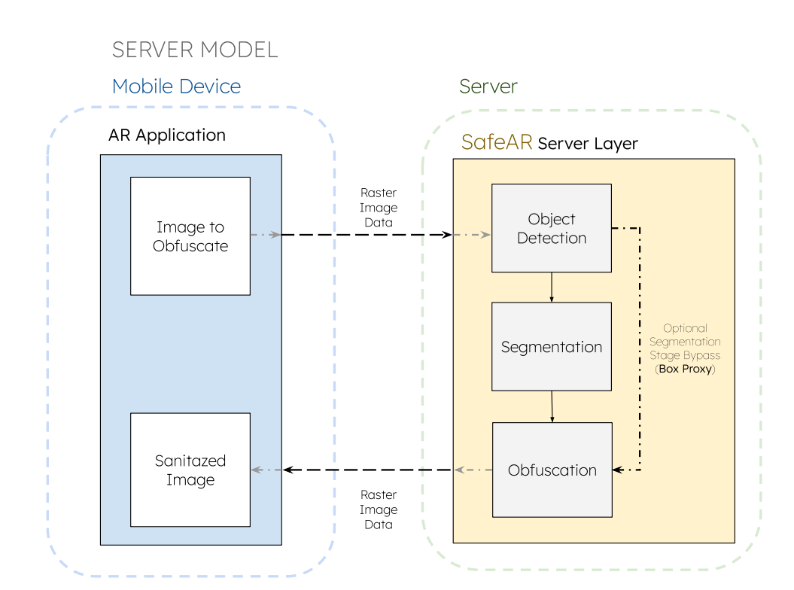

<div style="display: flex; align-items: center; justify-content: center;">

[//]: # (  )
  <h1 style="margin-left: 20px;">SafeAR - Privacy in AR Contexts as a Service</h1>
</div>

<!-- <div align="center">  <h1>SafeAR - Privacy in AR Contexts as a Service</h1> </div> -->

### Overview

Welcome to SafeAR, a privacy-focused solution designed for augmented reality (AR) contexts. Our system processes input
from mobile device cameras and returns a sanitized version of the data, ensuring that sensitive information is obscured.

<p align="center">  </p>

SafeAR Service receives images for obfuscation along with metadata specifying the classes to be obfuscated and the
respective method. It returns sanitized images to the client.
<br>

<p align="center">  </p>


Available Instance Segmentation Models
--------------------------------------

:construction:In development...

| Model       | Size (MB) | Training Data | Classes | Inference Time CPU (ms)\* | Inference Time GPU (ms)\* |
|-------------|-----------|---------------|---------|---------------------------|---------------------------|
| YOLOv5n-seg | 8.5       | COCO 2017     | 80      | -                         | -                         |
| YOLOv8n-seg | 13.8      | COCO 2017     | 80      |                           | ~20                       |
| YOLOv9c-seg | 111.1     | COCO 2017     | 80      | -                         | -                         |
| gelan-c-seg | 110.0     | COCO 2017     | 80      | -                         | -                         |
| RTMDet      | -         | COCO 2017     | 80      | -                         | -                         |

<small>\*Measured on: HP Victus, 32 GB of memory, Intel i5-12500Hx16 processor, Nvidia GeForceRTX 4060, Pop!\_OS 22.04
LTS operating system</small>

Repository Structure
--------------------

The repository is organized as follows:

```
safeAR-aaS/
│
├── 🏛️ assets/                   # Logos and other visual assets
├── 🚰 src/                      # Source code
├── 📁 seg_models/               # Pre-trained instance segmentation models (onnx format)
├── 🤷🏻‍♀️ .gitignore                # Git ignore file
├── 🛠️ config.yml                # Configuration file
├── 🐍 main.py                   # Main script to run the API
├── 📦  setup.py                  # Setup file for the API
├── 📜 README.md                 # Readme file
├── 🐳 Dockerfile                # Dockerfile for containerization
└── 📜 requirements.txt          # Required packages
```

Installation
------------

Clone the repository:

```sh
# Clone the repository
git clone https://github.com/CIIC-C-T-Polytechnic-of-Leiria/SafeAR.git
cd SafeAR

# Configure conda environment
conda create -n safeAR python=3.10
conda activate safeAR

# Install the required packages
pip install -r requirements.txt

```

:memo: Note
<small>

- The versions of CUDA, cuDNN, and ONNX Runtime must be compatible with each other and with your GPU. Check
  the [official documentation](https://onnxruntime.ai/docs/execution-providers/CUDA-ExecutionProvider.html) to ensure
  compatibility.
  </small>

Model Download and Conversion
-----------------------------

<details>
<summary> <b>Yolov5-seg</b> model </summary>
<br>

You may run this Colab [script](https://colab.research.google.com/drive/1BYFWd_h6ffWTa6SXqllYfYVxjxYj10tf?usp=sharing)
to download the model and convert them to ONNX format.

Afterwards, move the exported `onnx` model(s) to the `seg_models` directory.

</details>

<details>
<summary> <b>Yolov8-seg</b> model </summary>
<br>

You may download the model from the Ultralytics
repository: [Yolov8 Repository](https://docs.ultralytics.com/models/yolov8/#performance-metrics)

Afterwards, move the exported `onnx` model(s) to the `seg_models` directory.

</details>

<details>
<summary> <b>Yolov9-seg</b> and <b>Gelan</b> models </summary>
<br>

You may run this Colab [script](https://colab.research.google.com/drive/1Sv6cvCuAHWOOouXKy1dJ-G18RtMSk7dA?usp=sharing)
to download the models and convert them to ONNX format.

Afterwards, move the exported `onnx` model(s) to the `seg_models` directory.
</details>


<details>
<summary> <b>RTMDet</b> model </summary>
<br>
Under construction...

</details>

Usage
-----

### Command-Line Interface

The CLI provides a convenient way to obfuscate images using various obfuscation techniques. Here are the available
options:

```bash
python main.py \
	--model_number MODEL_NUMBER \
	--class_id_list CLASS_ID_1 CLASS_ID_2 ... \
	--obfuscation_type_list OBFS_TYPE_1 OBFS_TYPE_2 ...  \
	[--square PIXEL_SIZE] \
	[--sigma BLUR_EFFECT_VALUE]
```

#### Parameters:

- `MODEL_NUMBER`: Specifies the model to use for object detection. The available models are listed in `config.yml`. The
  model number is a 0-based index.
- `CLASS_ID_1 CLASS_ID_2 ...`: A list of class IDs corresponding to the objects you want to obfuscate. Separate multiple
  class IDs with spaces. If the model is trained on the COCO dataset, refer to the mapping provided
  in `seg_models/mscoco_classID_labels.txt`.
- `OBFS_TYPE_1 OBFS_TYPE_2 ...`: Available obfuscation types include `blurring`, `masking`, and `pixelation`. Specify
  the desired obfuscation type for each class ID.
- `[--square PIXEL_SIZE]`: Optional. Specifies the size of the square for the pixelation effect. The image will be
  divided into squares of the specified size, and each square will be replaced with a single color.
- `[--sigma BLUR_EFFECT_VALUE]`: Optional. Specifies the sigma value for the blurring effect. Higher values result in a
  stronger blurring effect.

### As a Python Module

You can also use the `SafeARService` class directly in your Python scripts for more flexibility and customization.
Here's an example usage:

```python
from safear_service import SafeARService

# Initialize the SafeARService
safe_ar_service = SafeARService()

# Configure the SafeARService with the desired model number and obfuscation policies
safe_ar_service.configure(model_number=0, obfuscation_policies={0: "blurring", 1: "blurring"})

# Auxiliary function to read the base64 image from a file
image_base64 = safe_ar_service.read_base64_image("test_samples/images/img_640x640_base64.txt")

# Image Obfuscation using the SafeARService
processed_frame_bytes = safe_ar_service.process_frame(image_base64)

# Auxiliary function to save the processed frame to a file
safe_ar_service.save_processed_frame(processed_frame_bytes, "outputs/img_out.png")
```

Upcoming Features
-----------------

We are continuously improving and adding new features to our system. Here's what you can expect in the near future:

- **Model selection**: SafeAR will allow users to select from a variety of pre-trained models for object detection and
  segmentation.
- **Metadata anonymization**: SafeAR will accept metadata from images or videos and anonymize it before returning it to
  the user, ensuring privacy.
- **Sensor data utilization**: Our system will be able to utilize sensor data from the mobile device to enhance
  performance and provide a better user experience.
- **Inpainting obfuscation**: Our Obfuscation module will offer inpainting as an obfuscation technique, providing even
  more options for securing sensitive information
- **Package distribution**: SafeAR will be available as a package on PyPI, making it easier to install and use.

Acknowledgements
----------------

This work is funded by FCT - Fundação para a Ciência e a Tecnologia, I.P., through project with reference
2022.09235.PTDC.


License
-------

This project is licensed under [GPLv3](https://www.gnu.org/licenses/gpl-3.0.html).

<p align="center">

</p>


