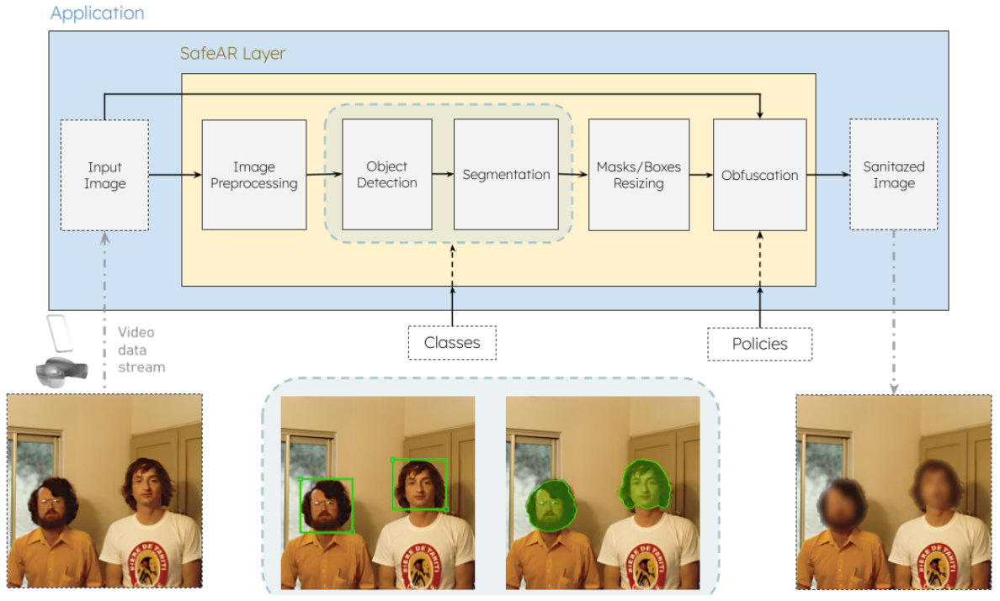

<!-- <div style="display: flex; align-items: center; justify-content: center;">

[//]: # (  )
  <h1 style="margin-left: 20px;">SafeAR - Privacy in AR Contexts as a Service </h1>
</div>-->

<!-- <div align="center">  <h1>SafeAR - Privacy in AR Contexts as a Service</h1> </div> -->

# SafeAR - Privacy in AR Contexts as a Service

### Overview

Welcome to SafeAR, a privacy-focused solution designed for augmented reality (AR) contexts. Our system processes input from mobile device cameras and returns a sanitized version of the data, ensuring that sensitive information is obscured.

<p align="center">  </p>

SafeAR Service receives images for obfuscation along with metadata specifying the classes to be obfuscated and the respective method. It returns sanitized images to the client.
<br>

<p align="center">  </p>


Repository Structure
--------------------

The repository is organized as follows:

```
safeAR-aaS/
│
├── 🏛️ assets/                   # Logos and other visual assets
├── 🚰 src/                      # Source code
├── 📁 seg_models/               # Pre-trained instance segmentation models (onnx format)
├── 🖼️ test_samples/             # Test images or samples
├── 🤷🏻‍♀️ .gitignore                # Git ignore file
├── 🛠️ config.yml                # Configuration file
├── 🐳 Dockerfile                # Dockerfile for containerization
├── 📜 LICENSE                   # License file
├── 🐍 main.py                   # Main script to run the API
├── 📜 README.md                 # Readme file
├── 📦 requirements.txt          # Required packages for the API
├── 📦 requirements_client.txt   # Required packages for the client
└── 📦 setup.py                  # Setup file for the API
```

Installation
------------
<details>
<summary> Conda</summary>
[**Conda**](https://conda.io/projects/conda/en/latest/user-guide/install/index.html) Environment:

```bash
# Clone the repository
git clone https://github.com/CIIC-C-T-Polytechnic-of-Leiria/SafeAR.git
cd SafeAR

# Configure conda environment
conda create -n safeAR python=3.10

# Install CUDA and cuDNN (to use NVidia GPU)
conda install cudatoolkit=12.2 cudnn= 8.9.2.26 -c conda-forge 

# Install the required packages
pip install -r requirements.txt
```

Note:
<small>
The versions of CUDA, cuDNN, and ONNX Runtime must be compatible with each other and with your GPU.
Check the [official documentation](https://onnxruntime.ai/docs/execution-providers/CUDA-ExecutionProvider.html) to
ensure compatibility.
</small>

</details>

<details>
<summary> Docker</summary>

[**Docker**](https://www.docker.com/get-started/) Image:

Install [NVIDIA Container Toolkit](https://docs.nvidia.com/datacenter/cloud-native/container-toolkit/latest/install-guide.html),
if not already installed. In the project root directory, build the Docker image:

 ```bash
 docker build --rm -t safear:v1 .
 ```
</details>

Model Download and Conversion
-----------------------------

<details>
<summary> <b>Yolov5-seg</b> model </summary>
<br>

You may run this Colab [script](https://colab.research.google.com/drive/1BYFWd_h6ffWTa6SXqllYfYVxjxYj10tf?usp=sharing)
to download the model and convert them to ONNX format.

Afterward, move the exported `onnx` model(s) to the `seg_models` directory.

</details>

<details>
<summary> <b>Yolov8-seg</b> model </summary>
<br>

You may download the model from the Ultralytics
repository: [Yolov8 Repository](https://docs.ultralytics.com/models/yolov8/#performance-metrics)

Afterward, move the exported `onnx` model(s) to the `seg_models` directory.

</details>

<details>
<summary> <b>Yolov9-seg</b> and <b>Gelan</b> models </summary>
<br>

You may run this Colab [script](https://colab.research.google.com/drive/1Sv6cvCuAHWOOouXKy1dJ-G18RtMSk7dA?usp=sharing)
to download the models and convert them to ONNX format.

Afterward, move the exported `onnx` model(s) to the `seg_models` directory.
</details>

<details>
<summary> <b>RTMDet</b> model </summary>
<br>
Under construction...

</details>

Instance Segmentation Models Comparison
---------------------------------------
<details>
<summary> 🚧 : Under construction... </summary>
<br>

| Model       | Size (MB) | Training Data | Classes | Inference Time CPU (ms)\* | Inference Time GPU (ms)\* |
|-------------|-----------|---------------|---------|---------------------------|---------------------------|
| YOLOv5n-seg | 8.5       | COCO 2017     | 80      | -                         | -                         |
| YOLOv8n-seg | 13.8      | COCO 2017     | 80      | -                         | ~20                       |
| YOLOv9c-seg | 111.1     | COCO 2017     | 80      | -                         | -                         |
| gelan-c-seg | 110.0     | COCO 2017     | 80      | -                         | -                         |
| RTMDet      | -         | COCO 2017     | 80      | -                         | -                         |

*Note:*
<small> Measured on: HP Victus, 32 GB of memory, Intel i5-12500Hx16 processor, Nvidia GeForceRTX 4060, Pop!\_OS 22.04
LTS operating system </small>
</details>


Usage
--------

#### SafeAR Service Parameters

|  | Parameter | Description | 
| :---: |:--- | :--- | 
| ⚙️ |`model_number` | Object detection model index (0-based) |
| 📝 |`class_id_list` | Class IDs to obfuscate (space-separated) | 
| 🎨 |`obfuscation_type_list` | Obfuscation types: ☁️ blurring, 🕳️ masking, or ▩️ pixelation (space-separated) |
| 📷 | `image_base64_file` | Path to base64-encoded image file | 
| σ | `sigma` | Blurring effect sigma value (optional) |

For a full list of class IDs, refer to [coco_class_list.txt](assets\coco_class_list.txt)

### Command-Line Interface

Basic example:


```bash
python main.py \
    --model_number 0 \
    --class_id_list 0 \
    --obfuscation_type_list blurring \
    --image_base64_file test_samples/images/img_640x640_base64.txt
```


### Docker Usage

```bash
docker run -it safear --model_number 0 \
                      --class_id_list 0 \
                      --obfuscation_type_list blurring \
                      --image_base64_file test_samples/images/img_640x640_base64.txt
```

*Note*: <small> Modify the Docker command as needed for your specific use case.. </small>

### Python Module Usage

You can also use the `SafeARService` class directly in your Python scripts for more flexibility and customization.
Here's an example usage:

```python 
from safear_service import SafeARService

# 🚀 Initialize the SafeARService instance
safe_ar_service = SafeARService()

# ⚙️ Configure the SafeARService with the desired model number and obfuscation policies
safe_ar_service.configure(model_number=0, obfuscation_policies={0: "blurring", 1: "masking"})

# Auxiliary functions (for testing only)
image_base64 = safe_ar_service.read_base64_image("test_samples/images/img_640x640_base64.txt")

# 🛡️ Core: Image Obfuscation
processed_frame_bytes = safe_ar_service.process_frame(image_base64)

# Auxiliary function (for testing only)
safe_ar_service.save_processed_frame(processed_frame_bytes, "outputs/img_out.png")
```

TODOs
-----

Here are the main tasks we need to complete:

- [ ] Update all documentation to reflect the latest changes and features
- [ ] Implement model selection feature pipeline
- [ ] Develop metadata anonymization functionality
- [ ] Integrate mobile device sensor data utilization
- [ ] Add inpainting as an obfuscation technique options
- [ ] Prepare SafeAR for distribution as a PyPI package

Acknowledgements
----------------

This work is funded by FCT - Fundação para a Ciência e a Tecnologia, I.P., through project with reference
2022.09235.PTDC.


License
-------

This project is licensed under [GPLv3](https://www.gnu.org/licenses/gpl-3.0.html).

<p align="center">

</p>
