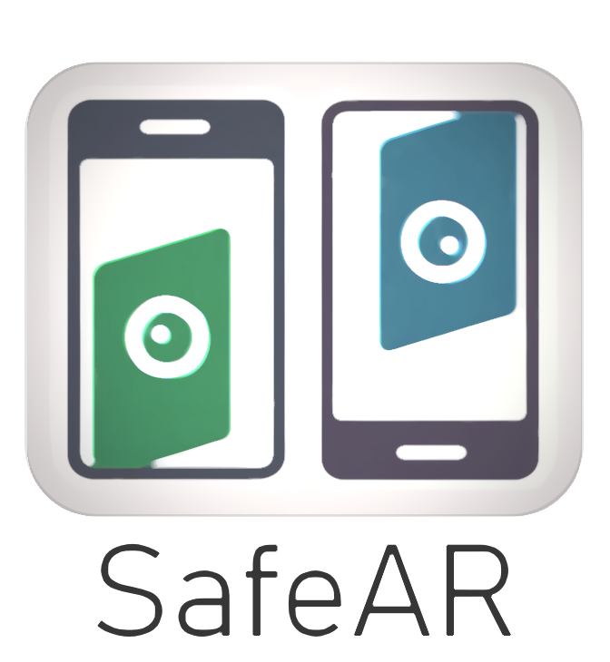

<!-- <div style="display: flex; align-items: center; justify-content: center;">

[//]: # (  )
  <h1 style="margin-left: 20px;">SafeAR - Privacy in AR Contexts as a Service </h1>
</div>-->

<!-- <div align="center">  <h1>SafeAR - Privacy in AR Contexts as a Service</h1> </div> -->

# SafeAR - Privacy in AR Contexts as a Service

### Overview

Welcome to SafeAR, a privacy-focused solution designed for augmented reality (AR) contexts. Our system processes input
from mobile device cameras and returns a sanitized version of the data, ensuring that sensitive information is obscured.

<p align="center">  </p>

SafeAR Service receives images for obfuscation along with metadata specifying the classes to be obfuscated and the
respective method. It returns sanitized images to the client.
<br>

<p align="center">  </p>


Repository Structure
--------------------

The repository is organized as follows:

```
safeAR-aaS/
│
├── 🏛️ assets/                   # Logos and other visual assets
├── 🚰 src/                      # Source code
├── 📁 seg_models/               # Pre-trained instance segmentation models (onnx format)
├── 🤷🏻‍♀️ .gitignore                # Git ignore file
├── 🛠️ config.yml                # Configuration file
├── 🐍 main.py                   # Main script to run the API
├── 📦 setup.py                  # Setup file for the API
├── 📜 README.md                 # Readme file
├── 🐳 Dockerfile                # Dockerfile for containerization
└── 📜 requirements.txt          # Required packages
```

Installation
------------

[**Conda**](https://conda.io/projects/conda/en/latest/user-guide/install/index.html) Environment:

```bash
# Clone the repository
git clone https://github.com/CIIC-C-T-Polytechnic-of-Leiria/SafeAR.git
cd SafeAR

# Configure conda environment
conda create -n safeAR python=3.10

# Install CUDA and cuDNN (to use NVidia GPU)
conda install cudatoolkit=12.2 cudnn= 8.9.2.26 -c conda-forge 

# Install the required packages
pip install -r requirements.txt
```

Note:
<small>
The versions of CUDA, cuDNN, and ONNX Runtime must be compatible with each other and with your GPU.
Check the [official documentation](https://onnxruntime.ai/docs/execution-providers/CUDA-ExecutionProvider.html) to
ensure compatibility.
</small>

[**Docker**](https://www.docker.com/get-started/) Image:

Install [NVIDIA Container Toolkit](https://docs.nvidia.com/datacenter/cloud-native/container-toolkit/latest/install-guide.html),
if not already installed. In the project root directory, build the Docker image:

 ```bash
 docker build --rm -t safear:v1 .
 ```

Model Download and Conversion
-----------------------------

<details>
<summary> <b>Yolov5-seg</b> model </summary>
<br>

You may run this Colab [script](https://colab.research.google.com/drive/1BYFWd_h6ffWTa6SXqllYfYVxjxYj10tf?usp=sharing)
to download the model and convert them to ONNX format.

Afterward, move the exported `onnx` model(s) to the `seg_models` directory.

</details>

<details>
<summary> <b>Yolov8-seg</b> model </summary>
<br>

You may download the model from the Ultralytics
repository: [Yolov8 Repository](https://docs.ultralytics.com/models/yolov8/#performance-metrics)

Afterward, move the exported `onnx` model(s) to the `seg_models` directory.

</details>

<details>
<summary> <b>Yolov9-seg</b> and <b>Gelan</b> models </summary>
<br>

You may run this Colab [script](https://colab.research.google.com/drive/1Sv6cvCuAHWOOouXKy1dJ-G18RtMSk7dA?usp=sharing)
to download the models and convert them to ONNX format.

Afterward, move the exported `onnx` model(s) to the `seg_models` directory.
</details>

<details>
<summary> <b>RTMDet</b> model </summary>
<br>
Under construction...

</details>

Instance Segmentation Models Comparison
---------------------------------------
<details>
<summary> 🚧 : Under construction... </summary>
<br>

| Model       | Size (MB) | Training Data | Classes | Inference Time CPU (ms)\* | Inference Time GPU (ms)\* |
|-------------|-----------|---------------|---------|---------------------------|---------------------------|
| YOLOv5n-seg | 8.5       | COCO 2017     | 80      | -                         | -                         |
| YOLOv8n-seg | 13.8      | COCO 2017     | 80      | -                         | ~20                       |
| YOLOv9c-seg | 111.1     | COCO 2017     | 80      | -                         | -                         |
| gelan-c-seg | 110.0     | COCO 2017     | 80      | -                         | -                         |
| RTMDet      | -         | COCO 2017     | 80      | -                         | -                         |

Note:
<small> Measured on: HP Victus, 32 GB of memory, Intel i5-12500Hx16 processor, Nvidia GeForceRTX 4060, Pop!\_OS 22.04
LTS operating system </small>
</details>


Usage
--------

### Command-Line Interface

The CLI provides a convenient way to obfuscate images using various obfuscation techniques.
Here's an example command to get you started:

```bash
python main.py \
    --model_number 0 \
    --class_id_list 0 \
    --obfuscation_type_list blurring \
    --image_base64_file test_samples/images/img_640x640_base64.txt
```

| Parameters              | Description                                                               | Required |
|-------------------------|---------------------------------------------------------------------------|----------|
| --model_number          | Model number for object detection (0-based index)                         | Yes      |
| --class_id_list         | Space-separated list of class IDs to obfuscate                            | Yes      |
| --obfuscation_type_list | Space-separated list of obfuscation types (blurring, masking, pixelation) | Yes      |
| --image_base64_file     | Path to the base64-encoded image file                                     | Yes      |
| --square                | Optional: size of the square for pixelation effect                        | No       |
| --sigma                 | Optional: sigma value for blurring effect                                 | No       |

#### Docker Example

You can also use Docker to run the CLI:

```bash
docker run -it safear --model_number 0 \
                      --class_id_list 0 \
                      --obfuscation_type_list blurring \
                      --image_base64_file test_samples/images/img_640x640_base64.txt
```

*Note*: The Docker command is just an example and may need to be modified to fit your specific use case.

### Python Module usage

You can also use the `SafeARService` class directly in your Python scripts for more flexibility and customization.
Here's an example usage:

```python
from safear_service import SafeARService

# Initialize the SafeARService
safe_ar_service = SafeARService()

# Configure the SafeARService with the desired model number and obfuscation policies
safe_ar_service.configure(model_number=0, obfuscation_policies={0: "blurring", 1: "blurring"})

# Auxiliary function to read the base64 image from a file
image_base64 = safe_ar_service.read_base64_image("test_samples/images/img_640x640_base64.txt")

# Image Obfuscation using the SafeARService
processed_frame_bytes = safe_ar_service.process_frame(image_base64)

# Auxiliary function to save the processed frame to a file
safe_ar_service.save_processed_frame(processed_frame_bytes, "outputs/img_out.png")
```

To-Do
-----

Here are the main tasks we plan to tackle in the near future:

- **Model selection**: Enable users to choose from multiple pre-trained models.
- **Metadata anonymization**: Implement metadata anonymization for enhanced privacy.
- **Sensor data utilization**: Leverage mobile device sensor data to boost performance.
- **Inpainting obfuscation**: Add inpainting as an obfuscation technique.
- **Package distribution**: Publish SafeAR as a PyPI package for easier installation.

Acknowledgements
----------------

This work is funded by FCT - Fundação para a Ciência e a Tecnologia, I.P., through project with reference
2022.09235.PTDC.


License
-------

This project is licensed under [GPLv3](https://www.gnu.org/licenses/gpl-3.0.html).

<p align="center">

</p>
