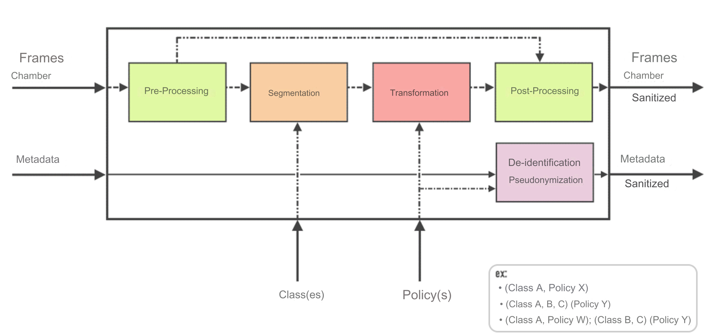

<!-- <div style="display: flex; align-items: flex-end;">

<h1 style="margin-left: 20px;">SafeAR SaaS - Privacy in AR contexts as a service</h1>
</div> -->


# SafeAR - Privacy in AR contexts aaS

<br/><br/>

Introducing SafeAR aaS - the ultimate privacy solution for AR contexts! Our system takes input from mobile device cameras and returns a sanitazed version of the data with sensitive information obscured.

<p align="center">

</p>

With four modules - `Preprocessing`, `Object Detection` and `Segmentation`, `Transformation` (or Obfuscation), and `Post-processing` - SafeAR aaS ensures privacy protection.

<p align="center">

</p>

We're constantly improving and adding new features to our system. Here's what's coming up next:

- Model selection: SafeAR SaaS will allow users to select from a variety of pre-trained models for object detection and segmentation.
- Metadata anonymization: SafeAR SaaS will accept metadata from images or videos and anonymize it before returning it to the user, ensuring privacy.
- Sensor data utilization: Our system will be able to utilize sensor data from the mobile device to enhance performance and provide  better user experience.
- Inpainting obfuscation: Our Obfuscation module will offer inpainting as an obfuscation technique, providing even more options for securing sensitive information.


Available Instance Segmentation Models
--------------------------------------

In development...


| Model | Size (MB) | Training Data | Classes | Inference Time CPU (ms)\* | Inference Time GPU (ms)\* |
| --- | --- | --- | --- | --- | --- |
| YOLOv5n-seg | - | COCO 2017 | 80 | - | - |
| YOLOv8n-seg | - | COCO 2017 | 80 | - | - |
| YOLOv9c-seg | - | COCO 2017 | 80 | - | - |
| gelan-c-seg | - | COCO 2017 | 80 | - | - |
| RTMDet | - | COCO 2017 | 80 | - | - |

<small>\*Measured on: HP Victus, 32 GB of memory, Intel i5-12500Hx16 processor, Nvidia GeForceRTX 4060, Pop!\_OS 22.04 LTS operating system</small>

Repository Structure
--------------------

The repository is organized as follows:

```
safeAR-aaS/
│
├── 🏛️ assets/                   # Logos and other visual assets
├── 🚰 src/                      # Source code
├── 📁 seg_models/               # Pre-trained instance segmentation models (onnx format)
├── 🤷🏻‍♀️ .gitignore                # Git ignore file
├── 🛠️ config.yml                 # Configuration file
├── 🐍 main.py                   # Main script to run the API
├── 📜 README.md                 # Readme file
└── 📜 requirements.txt          # Required packages
```

Installation
------------

Clone the repository:
```bash
git clone https://github.com/CIIC-C-T-Polytechnic-of-Leiria/SafeAR.git
cd SafeAR
```
Create a new Conda environment (optional):
```bash
conda create -n safear_env python=3.10
conda activate safear_env
```
Install the CUDA Toolkit and CuDNN:

```bash
conda install cudatoolkit=11.8
conda install cudnn=8.2.4
```
Install the required packages:
```bash
pip install -r requirements.txt
```

Install ONNX Runtime with GPU support:

```bash
pip install onnxruntime-gpu==1.17.0
```

:memo: Note:

- SafeAR aaS was tested using Python 3.10.12 environment.
- For Nvidia GPU computers, install onnxruntime-gpu package.
- For non-Nvidia GPU computers, use onnxruntime package.
- The versions of CUDA, CuDNN, and ONNX Runtime must be compatible with each other and with your GPU. Always check the [official documentation](https://onnxruntime.ai/docs/execution-providers/CUDA-ExecutionProvider.html) for each package to ensure compatibility.

Model Download and Conversion
------------------------------ 

<details>
<summary> <b>Yolov5-seg</b> model </summary>

You may run [this Colab script](https://colab.research.google.com/drive/1BYFWd_h6ffWTa6SXqllYfYVxjxYj10tf?usp=sharing) to download the model and convert them to ONNX format.

Afterwards, move the exported `onnx` model(s) to the `seg_models` directory.


<!-- For setup instructions, please follow the links to the respective repositories:

- **Yolov5-seg**: [Yolov5 Repository](https://gitcode.net/openmodel/yolov5-seg)

Afterwards, move the exported `onnx` model(s) to the `seg_models` directory. -->

</details>

<details>
<summary> <b>Yolov8-seg</b> model </summary>

For setup instructions, please follow the links to the respective repositories:

- **Yolov8-seg**: [Yolov8 Repository](https://docs.ultralytics.com/models/yolov8/#performance-metrics) 

Afterwards, move the exported `onnx` model(s) to the `seg_models` directory.

</details>


<details>
<summary> <b>Yolov9-seg</b> and <b>Gelan</b> models </summary>

You may run [this Colab script](https://colab.research.google.com/drive/1Sv6cvCuAHWOOouXKy1dJ-G18RtMSk7dA?usp=sharing) to download the models and convert them to ONNX format.

Afterwards, move the exported `onnx` model(s) to the `seg_models` directory.


<!-- To convert the process of downloading four YOLOv9 model weights, converting them to ONNX format, and moving the exported models to a specific folder in GitHub Markdown, while also deleting the original .pt files, follow these steps:

1. **Create Weights Directory**:
```bash
!mkdir -p {HOME}/weights
```
2. **Download Model Weights**:

Choose one of the following `yolov9-c-seg.pt`, `gelan-c-seg.pt`:

```bash
!wget -P {HOME}/weights -q https://github.com/WongKinYiu/yolov9/releases/download/v0.1/{MODEL_NAME}.pt
```

3. **Export Models to ONNX and Move to seg_models Folder**:

For each model, run the export.py script with the appropriate arguments to export the model to ONNX format. Then, move the ONNX files to the seg_models folder and delete the original .pt files.

```bash

python export.py --weights {HOME}/weights/model_name.pt --include onnx
mv {HOME}/weights/model_name.onnx seg_models/
rm {HOME}/weights/model_name.pt
``` 
Replace model_name with the name of the model you're exporting (e.g., yolov9-c, yolov9-e, gelan-c, gelan-e).

This guide provides a concise way to download YOLOv9 model weights, convert them to ONNX format, move the exported models to a specified folder, and clean up the original .pt files. -->
</details>


<details>
<summary> <b>RTMDet</b> model </summary>

Under construction...

</details>


Usage
-----

The API can be used both as a command-line tool and as a Python library.

### Command-Line Usage

To use the API as a command-line tool, run the following command:
```bash
python main.py 
    --model_number MODEL_NUMBER 
    --class_id_list CLASS_ID_1 CLASS_ID_2 ... 
    --obfuscation_type_list OBFS_TYPE_1 OBFS_TYPE_2 ... 
    --img_source IMG_SOURCE 
    --show_fps
    --show_boxes
    --save_video
```
where:

* `MODEL_NUMBER` is the number of the model to use (0-based index).
* `CLASS_ID_1 CLASS_ID_2 ...` is a list of class IDs to obfuscate. If model is trained in COCO dataset, see the mapping [here](seg_models/mscoco_classID_labels.txt)
* `OBFS_TYPE_1 OBFS_TYPE_2 ...` available obfuscation types are `bluring`, `masking`, and `pixelation`.
* `IMG_SOURCE` is the source of the images to process. This can be a file path, a URL, or a camera index.
* `--show_fps` is an optional flag to show the frames per second.
* `--show_boxes` is an optional flag to save the bounding boxes to a file.
* `--save_video` is an optional flag to save the processed video to a file.

For example:
```bash
python main.py 
    --model_number 0 
    --class_id_list 0 1 2 
    --obfuscation_type_list bluring masking pixelation 
    --img_source 0 --show_fps
```
This will use the first available model to obfuscate objects with class IDs 0, 1, and 2 in the video stream from the default camera, using the `bluring`, `masking`, and `pixelation` obfuscation types, and showing the frames per second on the screen.

### Python Library Usage

To be implemented...

Acknowledgements
----------------

This work is funded by FCT - Fundação para a Ciência e a Tecnologia, I.P., through project with reference 2022.09235.PTDC.

<!-- Contributing
------------

TO BE DONE... -->

License
-------

To be determined...

<p align="center">

</p>